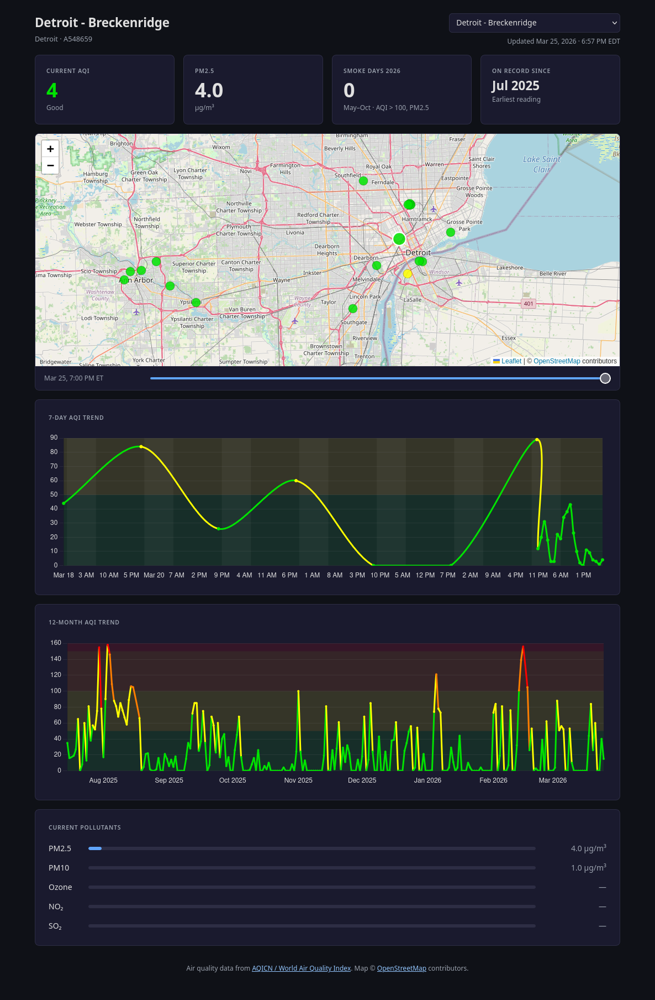

# 48208-air

A Django app that collects and visualizes air quality data across a regional
sensor network centered on Detroit's Core City neighborhood (ZIP 48208), one
of Michigan's most polluted communities.



The primary sensor (`A548659`, GAIA A12) is located on Breckenridge St and
feeds into the [World Air Quality Index](https://aqicn.org) global network.
It is currently the **only community air sensor in Detroit's Core City
neighborhood with public AQICN reporting** (many PurpleAir sensors exist
in the region but are not aggregated into AQICN).

The network also tracks upwind stations (Ann Arbor, Ypsilanti) for early
wildfire smoke warning, and downwind stations (Windsor, Grosse Pointe) for
plume confirmation, based on the region's prevailing SW→NE winds.

A recurring theme in the data: dramatic PM2.5 spikes during Canadian wildfire
season (May–October), visible as AQI readings above 100 dominated by fine
particulate matter drifting southeast across the Great Lakes into Detroit.

A secondary purpose of this project is **pre-construction baseline documentation**
for a proposed large industrial facility nearby. Readings are timestamped and
archived so that post-construction air quality can be compared against a
statistically sound pre-construction baseline across PM2.5, PM10, NO2, and SO2.

---

## Regional station network

Stations are seeded via `load_stations` and organized by wind relationship to
the primary sensor:

| Wind position | Stations | Purpose |
|---|---|---|
| **Upwind** | Ann Arbor (×5), Ypsilanti | Early warning, smoke arrives here before 48208 |
| **Primary** | Detroit - Breckenridge | Home sensor, baseline + real-time |
| **Crosswind** | Dearborn, Allen Park, Oak Park, Hamtramck (×4) | Industrial comparison reference |
| **Downwind** | Windsor (×3), Grosse Pointe | Plume confirmation, wind reversal detection |

The Hamtramck cluster (4 sensors) was placed around the GM Factory ZERO EV
assembly plant, a useful EJ monitoring comparison for 48208's cumulative
industrial burden.

Two offline Michigan DEQ stations (`Detroit - W Lafayette`, `Detroit - Southwest`)
are included as `active=False` and together provide a continuous official
baseline for SW Detroit from 2014 through June 2025.

---

## Setup

### 1. Create virtual environment and Install dependencies

```bash
python3 -m venv .venv
source .venv/bin/activate.fish  # `deactivate` when finished
pip install django requests django-apscheduler
```

### 2. Get a WAQI API token

Free token at: https://aqicn.org/api/  
Tokens are issued immediately via email. The free tier allows 1,000
requests/day, sufficient for hourly polling of 18 active stations (432/day).

### 3. Configure settings

```bash
cp .env.example .env
# Edit .env and set SECRET_KEY and WAQI_API_TOKEN
```

Settings are loaded from `.env` via `python-dotenv`. See `.env.example`
for all available options including database and allowed hosts.

### 4. Run migrations and seed stations

```bash
python manage.py migrate
python manage.py load_stations
```

### 5. Import historical data (optional)

Download daily CSV exports from [aqicn.org/data-platform/](https://aqicn.org/data-platform/)
for each station and place them in `historical_data/`. Then:

```bash
python manage.py import_historical --dry-run  # preview
python manage.py import_historical            # load
```

Note: `historical_data/` is excluded from git per WAQI data use terms.

### 6. Test and go live

```bash
# Dry run first: fetches all stations but doesn't save
python manage.py fetch_aqi --dry-run

# Fetch a single station by ID
python manage.py fetch_aqi --station @548659

# Fetch all active stations
python manage.py fetch_aqi
```

### 7. Run the dashboard

```bash
python manage.py runserver
```

Open `http://localhost:8000/`. The dashboard shows:

- **Stat bar**: current AQI, PM2.5, wildfire smoke days this year, earliest reading date
- **Regional map**: all 20 stations as colored circles (green/yellow/orange/red/purple/maroon
  by AQI category); click any marker for a popup; use the time scrubber below the map to
  replay the last 7 days of hourly readings across all stations
- **7-day chart**: individual hourly readings on a time axis, night periods shaded
- **12-month chart**: daily averages for the past year
- **Pollutant breakdown**: latest PM2.5, PM10, ozone, NO2, SO2 values with normalized bars

Use the station dropdown (top right) to switch between any of the 20 network stations.
The dashboard adapts to your OS light/dark preference automatically.

---

## Testing

```bash
make check        # lint + format check + tests (full CI check)
make test         # tests only, with coverage report
make lint         # ruff linter only
make fmt          # auto-format with ruff (modifies files)
```

Tests use an in-memory SQLite database and mock all HTTP calls. Coverage
is enforced at 83% minimum; `make test` fails if it drops below.

---

## Scheduling

Add a cron entry to poll all active stations every hour:

```
0 * * * * cd /path/to/48208-air && .venv/bin/python manage.py fetch_aqi >> fetch_aqi.log 2>&1
```

---

## Data notes

- `station_time` is stored in UTC; convert to `America/Detroit` for display
- `unique_together = [("station", "station_time")]` makes polling idempotent,
  running `fetch_aqi` multiple times in the same hour is safe
- `is_wildfire_smoke_likely` on `AQIReading` is a PM2.5 + fire-season heuristic
  (May–Oct, AQI > 100, dominant pollutant = pm25), useful for UI flagging,
  not authoritative source attribution
- WAQI returns `aqi = "-"` when a station is temporarily offline; the command
  logs an error for that station and continues with the rest
- `dominant_pollutant` uses WAQI's field name `dominentpol` (their typo, preserved)
- Pollutant signatures to watch for construction/industrial events:
  - **PM10**: coarse dust (earthwork, demolition), distinct from PM2.5 smoke
  - **NO2**: diesel exhaust, correlates with truck traffic increases
  - **SO2**: industrial combustion, relevant for diesel generators (data centers)

---

## Baseline monitoring

The baseline period began when the primary sensor was installed. To lock in a
formal pre-construction baseline snapshot:

```python
# Example: export baseline stats for PM2.5 before a given date
from django.db.models import Avg, StdDev
from aqi_tracker.models import AQIReading, Station

primary = Station.objects.get(is_primary=True)
baseline = AQIReading.objects.filter(
    station=primary,
    station_time__lt="2026-01-01",  # adjust to construction start date
).aggregate(
    avg_pm25=Avg("pm25"),
    stddev_pm25=StdDev("pm25"),
    avg_aqi=Avg("aqi"),
    stddev_aqi=StdDev("aqi"),
)
```

---

## Roadmap

- [x] **TODO 1**:Models + single-station fetch command
- [x] **TODO 2**:Multi-station `Station` model; regional network; `load_stations`
- [x] **TODO 3**:Verify and fix regional station network (20 stations, real WAQI IDs + coordinates)
- [x] **TODO 4**:Historical data import: 30,942 readings across 20 stations, back to 2014
- [x] **TODO 5**:Test suite (pytest; models, management commands)
- [x] **TODO 6**:Dashboard: stat bar, regional map with 7-day time scrubber, hourly and monthly trend charts, pollutant breakdown, station switcher dropdown
- [ ] **TODO 7**:EPA EJScreen overlay for 48208; socioeconomic context layer
- [ ] **TODO 8**:Baseline deviation alerts: notify when readings exceed
      pre-construction norms by >2σ on PM10, NO2, or SO2
- [ ] **TODO 9**:PurpleAir API integration: pull nearby sensors not on AQICN
      to fill coverage gaps (Detroit proper has many PurpleAir sensors)
